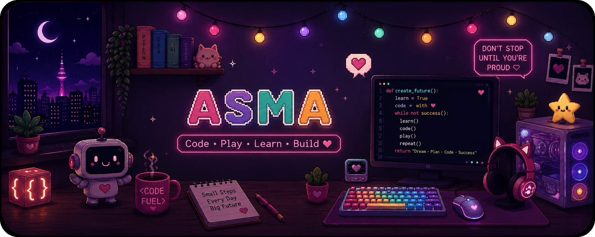

<p align="center">
  
</p>

<div align="center">

# 👩🏻‍💻 Hi, I'm Asma

### I learn • I build • I explore

🌍 Curious about everything — because there's always something new to discover.

`🎮 GAME`　•　`💻 CODE`　•　`✨ CREATE`

</div>

---

## 🌷 About Me

🎓 BSc in **Management Information Systems**

💻 Currently studying a **Diploma in Computer Science & Data Analytics**

🤖 Interested in **AI, Programming, Data & Technology**

🎮 I love **Coding, Gaming & Building Digital Experiences**

🌍 Curious about how things work — from technology to everything in between.

---

<div align="center">

### `< CODE />`　🌸　`LEVEL UP`　🎮　`REPEAT ↻`

</div>

---

## 🚀 LittleCoder

### 🤖 Coding & AI for Little Minds

I'm the founder of **LittleCoder**, an educational platform designed to introduce children to the fundamentals of **Programming & Artificial Intelligence** through fun and interactive learning experiences.

🎮 **Challenges & Missions**  
📖 **Interactive Lessons & Stories**  
🤖 **Learning with Robo**  
💻 **Hands-on Coding**  
🏆 **Projects & Adventures**

<div align="center">

### 🌱 Learn → Code → Experiment → Build ✨

</div>

---

## 🍬 Tech I Use

<div align="center">


</div>

---

## 🌱 Currently Exploring

- 💻 Computer Science
- 📊 Data Analytics
- 🐍 Python
- 🤖 Artificial Intelligence
- 🌐 Web Development

---

## 🎮 Developer Mode

```python
def asma():
    curious = True

    while curious:
        learn()
        code()
        experiment()
        build()

    return "Level Up ✨"
```

---

## 📊 GitHub Journey

<div align="center">


</div>

---

<div align="center">

### 🌸 Code • 🎮 Play • 🌍 Explore • 🚀 Build

**Always learning. Always building. Always curious.**

✨

</div>
